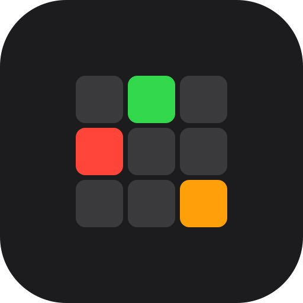
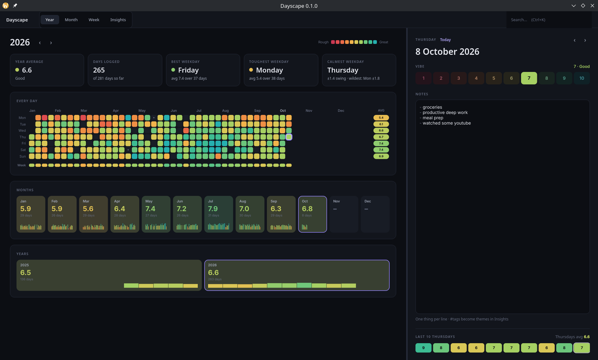
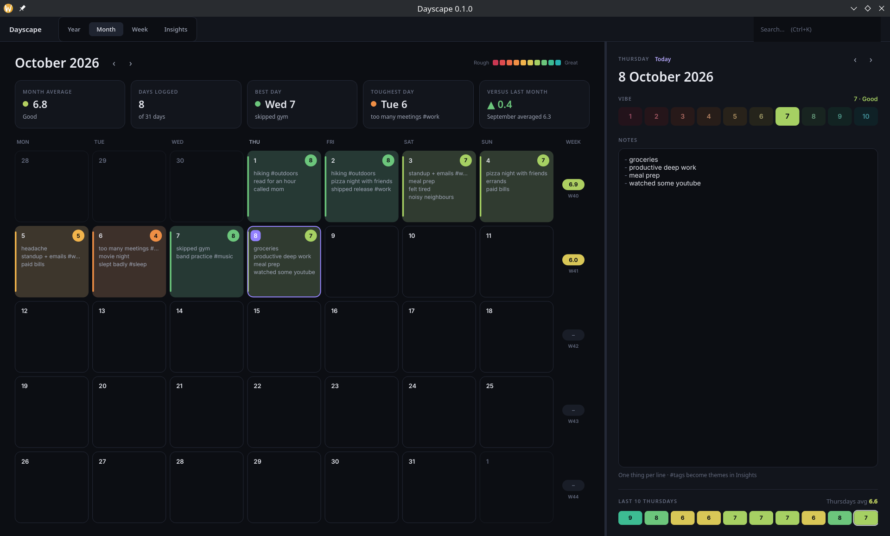
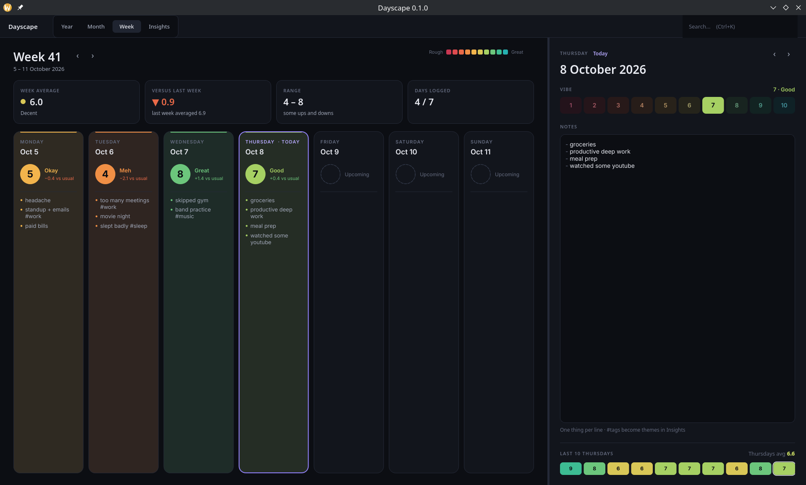
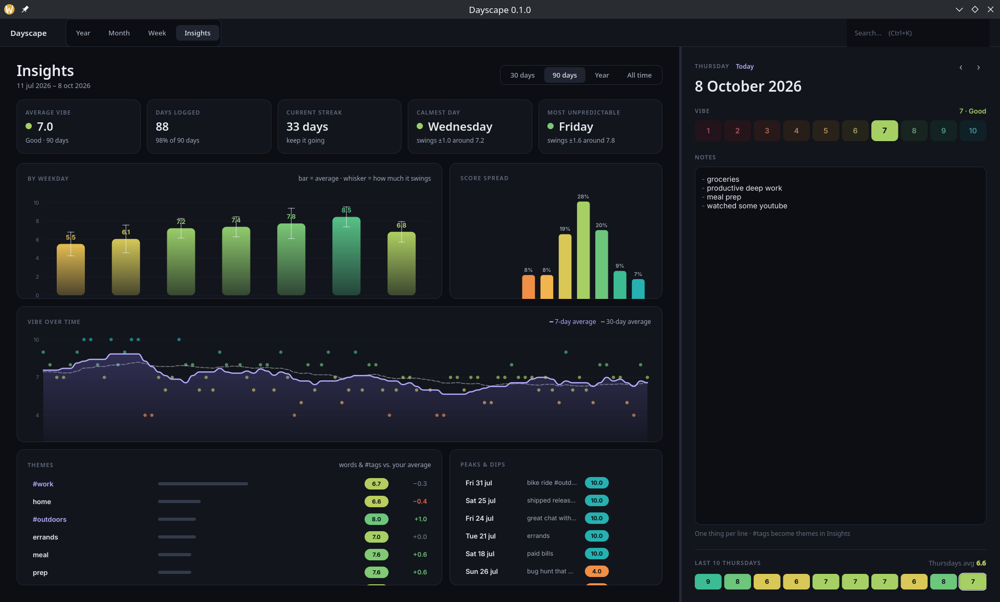

<div align="center">
  
  <h1>Dayscape</h1>
  <p>A fast, private, and beautiful daily vibe journal for your desktop.</p>
</div>

## Overview

**Dayscape** is a professional, elegantly-designed desktop application (powered by Python and PySide6/Qt) for logging your daily "vibes". Instead of feeling burdened by heavy journaling, Dayscape encourages 3-5 keywords or quick bullet points and a simple daily score (1-10).

With a dark-mode aesthetics, custom heatmaps, and a powerful search engine, you can effortlessly visualize your year, track trends across weekdays, and query your notes instantly.

## Screenshots









## Features

- ⚡️ **Frictionless Entry**: Select a day and just type. Autosave kicks in seamlessly.
- 🎨 **Visual Heatmaps**: See your entire year mapped out in a beautiful GitHub-commit-style graph, interpolated with unique colors based on your daily scores.
- 📊 **Insight Engine**: A dedicated dashboard showcasing rolling averages, weekday trends, and keyword/tag distributions.
- 🔍 **Live Search (`Ctrl+K`)**: Rapidly search by notes, tags (`#work`), or score conditions (`score:8-10`, `day:monday`).
- 🔒 **Private & Local**: Your data never leaves your machine. It's stored in a robust local SQLite database running in lightning-fast WAL mode.
- ❄️ **Nix Ready**: Ships with a fully declarative `flake.nix` for instant, reproducible development and building on NixOS/Linux.

## Installation & Usage

Dayscape uses Nix for its dependency management and build pipeline.

### Running Immediately (with sample data)
To test out the application with a randomly-seeded year of journal entries, you can run:
```bash
nix run . -- --demo
```

### Running Normally
To launch your actual journal:
```bash
nix run .
```

## Development

All dependencies, formatters (`ruff`), and testing libraries (`pytest`) are declarative. Jump straight into the dev shell:

```bash
nix develop
```

Once inside the shell, you can format, check, test, and run the app:

```bash
# Lint & Format
ruff check dayscape/ tests/
ruff format dayscape/ tests/

# Test
pytest tests/

# Run natively in the shell
python -m dayscape --demo
```

## License

GPLv3
